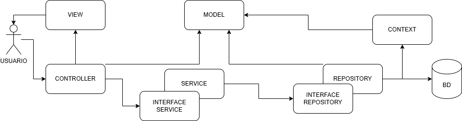

# 🖥️ HardReserve

> Sistema web para **reserva e gerenciamento de hardwares** de laboratório (Arduino, ESP-32, sensores, notebooks, etc.), feito como projeto final do curso usando **ASP.NET Core MVC** com **C#** e **Entity Framework Core**.

A ideia do projeto nasceu de um problema real que a gente vê no laboratório do SENAI: o controle dos componentes eletrônicos (quem pegou, quanto tem disponível, onde está guardado) normalmente é feito no papel ou numa planilha, e isso acaba virando uma bagunça. O **HardReserve** resolve isso de um jeito mais moderno, com um catálogo bonito, login de usuários e uma área para o técnico cadastrar novos equipamentos (inclusive com foto!).

---

## 📌 Índice

- [Tecnologias utilizadas](#-tecnologias-utilizadas)
- [Funcionalidades](#-funcionalidades)
- [Arquitetura do projeto](#-arquitetura-do-projeto-camadas)
- [Estrutura de pastas](#-estrutura-de-pastas)
- [Como rodar o projeto](#-como-rodar-o-projeto-passo-a-passo)
- [Banco de dados](#-banco-de-dados)
- [Telas do sistema](#-telas-do-sistema)
- [Cadastro de hardware com foto](#-cadastro-de-hardware-com-foto-como-funciona-por-dentro)
- [Dificuldades e aprendizados](#-dificuldades-e-aprendizados)
- [Equipe](#-equipe)

---

## 🚀 Tecnologias utilizadas

| Tecnologia | Para que serve no projeto |
|------------|---------------------------|
| **C#** | Linguagem principal do back-end |
| **ASP.NET Core MVC (.NET 10)** | Framework web, organiza tudo no padrão Model-View-Controller |
| **Entity Framework Core** | ORM que conversa com o banco de dados sem a gente precisar escrever SQL na mão |
| **SQL Server** | Banco de dados onde ficam os usuários, hardwares e reservas |
| **Razor (.cshtml)** | Motor de views, mistura HTML com C# |
| **Bootstrap 5** | Grid responsivo e alguns componentes |
| **Bootstrap Icons** | Ícones usados no sistema inteiro |
| **SweetAlert2** | Pop-ups e confirmações estilizadas (a mesma biblioteca usada no projeto da Biblioteca) |
| **CSS puro** | Toda a identidade visual "cyber/tech" (mais de 1.200 linhas de CSS!) |
| **Google Fonts (Orbitron + Inter)** | Tipografia, dão a cara futurista do projeto |

> ⚠️ Estamos usando **Entity Framework sem Migrations**. Ou seja, o banco é criado por um **script SQL** (que está na pasta `Scripts/`) e o EF só faz o mapeamento das classes para as tabelas.

---

## ✨ Funcionalidades

- 🔐 **Login com sessão** — o usuário entra com e-mail e senha. Os dados ficam guardados em `Session`, e as telas internas são protegidas (se você não estiver logado, é redirecionado pro login).
- 🏠 **Página inicial (Home)** — uma landing page com seção *hero*, um preview do catálogo e a chamada para acessar a plataforma.
- 📋 **Catálogo de hardwares (público)** — lista os equipamentos em formato de cards, com barra de busca e filtro por categoria. **Qualquer pessoa pode ver o catálogo**, mesmo sem estar logada — a exigência de login só começa quando o usuário tenta fazer uma reserva.
- 🛒 **Reserva tipo carrinho de compras** — uma tela onde o usuário adiciona os hardwares desejados a um carrinho, **escolhe a quantidade de cada item** (respeitando o que está disponível), define o período (data de retirada e devolução) e confirma. Lembra um e-commerce. **Exige login.**
- 🧾 **Protocolo + comprovante** — ao confirmar a reserva, o sistema gera um número de **protocolo** no formato `ddMMyyHHmmss` (dia+mês+ano+hora+minuto+segundo) e mostra um **comprovante** com todos os dados, que pode ser **baixado em PDF** (pela função de impressão do navegador).
- 📅 **Acompanhamento e gestão de reservas** — listagem das reservas com seus status. O status segue o modelo de negócio com 6 estados: **PE** (Pendente), **AP** (Aprovado), **CA** (Cancelado), **RE** (Retirada), **DE** (Devolvida) e **AT** (Atrasada). O **técnico** tem botões de ação para conduzir a reserva pelo fluxo: aprovar ou cancelar uma pendente, registrar a retirada (ou cancelar) uma aprovada, e registrar a devolução de uma retirada/atrasada. Cada mudança pede confirmação antes de efetivar.
- ➕ **Cadastro, edição e exclusão de hardware (área do técnico)** — formulário completo para adicionar um equipamento ao inventário, **com upload de foto**. No catálogo, o técnico também consegue **editar** (a mesma tela de cadastro abre já preenchida) e **excluir** os equipamentos. **Só aparece e só funciona para o perfil Técnico** (o botão no menu e o acesso pela URL são protegidos). A exclusão é bloqueada se o hardware já estiver em alguma reserva.
- 📦 **Controle de estoque** — cada hardware tem uma quantidade total, e o sistema calcula automaticamente quantas unidades ainda estão **disponíveis** (descontando o que está reservado). O catálogo mostra "X de Y disponíveis"; quando chega a zero, o item aparece como **Esgotado** e o botão de reserva fica desabilitado. A tela de reserva também não deixa reservar mais do que existe. Reservas canceladas ou devolvidas liberam as unidades de volta.
- 💬 **Pop-ups estilizados** — as confirmações (excluir hardware, confirmar reserva) e as mensagens de sucesso/erro usam o **SweetAlert2** com o tema visual do projeto, no lugar dos avisos padrão do navegador.
- 📱 **Responsividade** — o layout se adapta a celular, tablet e desktop (testado com as media queries do CSS).

---

## 🏗️ Arquitetura do projeto (camadas)

A gente seguiu o mesmo padrão de camadas que o professor ensinou no projeto da Biblioteca. A ideia é que **cada camada tenha uma responsabilidade só**, deixando o código organizado e fácil de dar manutenção:

```
Controller  →  Service  →  Repository  →  DbContext  →  Banco
   (recebe)     (regras)    (acessa o BD)   (EF Core)
```

- **Models** → são as classes que representam as tabelas do banco (`Hardware`, `Usuario`, `Reserva`, `Kit`, `Hardware_Reserva`).
- **Interfaces** → o "contrato" que diz quais métodos cada Repository e Service tem que ter.
- **Repositories** → a camada que realmente fala com o banco (usando o `DbContext` do Entity Framework).
- **Services** → onde ficam as regras de negócio (ex.: tratar o upload da imagem antes de salvar).
- **Controllers** → recebem as requisições do navegador, chamam o Service e devolvem a View.
- **Views (.cshtml)** → as telas em si (HTML + Razor).

Por que separar assim? Porque se um dia a gente trocar o banco, ou mudar uma regra, a gente mexe só na camada certa, sem quebrar o resto. 👍




---

## 📁 Estrutura de pastas

```
HardReserve/
├── Controllers/          → HomeController, LoginController, UsuarioController,
│                           HardwareController, ReservaController
├── Models/               → Hardware, Usuario, Reserva, Kit, Hardware_Reserva
├── Interfaces/           → contratos dos Repositories e Services
├── Repositores/          → implementação do acesso ao banco
├── Services/             → regras de negócio (inclui o upload de imagem)
├── Contexts/             → HardReserveDbContext (configuração do EF Core)
├── Views/
│   ├── Home/             → Index (landing page)
│   ├── Login/            → Index (tela de login)
│   ├── Hardware/         → Index (catálogo) e Cadastrar (cadastro com foto)
│   ├── Reserva/          → Listagem, Criar (carrinho) e Comprovante
│   └── Shared/           → _Layout (cabeçalho/rodapé padrão do site)
├── wwwroot/
│   ├── css/              → site.css (identidade visual) e catalogo.css
│   ├── js/               → site.js
│   ├── img/              → imagens dos hardwares e logos
│   │   └── hardwares/    → onde as FOTOS enviadas no cadastro são salvas
│   └── lib/              → Bootstrap e jQuery
├── Scripts/              → script SQL para criar o banco
├── appsettings.json      → configurações (string de conexão do banco)
└── Program.cs            → configuração e inicialização da aplicação
```

---

## ▶️ Como rodar o projeto (passo a passo)

### Pré-requisitos
- [.NET SDK 10](https://dotnet.microsoft.com/download)
- **SQL Server** (Express ou Developer) + **SQL Server Management Studio (SSMS)**
- **Visual Studio 2022** ou **VS Code**

### 1. Clonar o repositório
```bash
git clone https://github.com/caiohbdasilva/HardReserve.git
cd HardReserve
```

### 2. Configurar a string de conexão
Abra o arquivo `appsettings.json` e ajuste o `Server` para o nome do **seu** SQL Server:

```json
"ConnectionStrings": {
  "DefaultConnection": "Server=SEU_SERVIDOR;Database=Hard_Reserve;User Id=sa;Password=SUA_SENHA;TrustServerCertificate=True;MultipleActiveResultSets=true;"
}
```

> 💡 Para descobrir o nome do seu servidor, é só abrir o SSMS e olhar o campo "Nome do servidor" na tela de conexão.

### 3. Criar o banco de dados
Abra o **SSMS**, conecte no seu servidor e execute o script:

```
Scripts/DbHardReserve.sql
```

Esse script cria o banco `Hard_Reserve`, todas as tabelas e já insere alguns dados de teste (um usuário técnico, um aluno, alguns hardwares e algumas reservas de exemplo — uma de cada status, pra você ver as cores) pra você conseguir testar na hora.

> ⚠️ O script **recria o banco do zero**: se já existir um `Hard_Reserve`, ele apaga e cria de novo. Então rode com a aplicação fechada e lembre que dados cadastrados manualmente serão perdidos.

### 4. Rodar a aplicação
Pelo terminal:
```bash
dotnet run
```
Ou aperte **F5** no Visual Studio. Depois é só abrir o endereço que aparecer no terminal (algo como `https://localhost:7777`).

### 5. Fazer login
Use um dos usuários de teste que o script já cadastrou:

| Perfil | E-mail | Senha | O que pode fazer |
|--------|--------|-------|------------------|
| 🔧 **Técnico** | `tecnico@hardreserve.com` | `123` | Vê o catálogo **e** cadastra novos hardwares |
| 🎓 **Aluno** | `aluno@hardreserve.com` | `123` | Vê o catálogo (o botão "Cadastrar" fica escondido) |

> O controle de quem pode cadastrar é feito pelo campo **Role** do usuário (`'T'` = Técnico, `'P'` = Professor, `'A'` = Aluno). Só o Técnico vê o botão **Cadastrar** no menu — e, mesmo que alguém tente acessar a URL `/Hardware/Cadastrar` direto, o controller bloqueia quem não é técnico.

---

## 🗄️ Banco de dados

O banco se chama **Hard_Reserve** e tem 5 tabelas:

| Tabela | O que guarda |
|--------|--------------|
| `Usuario` | os usuários do sistema (alunos, professores e técnicos) |
| `Hardware` | os equipamentos do inventário |
| `Kit` | conjuntos de hardwares agrupados |
| `Reserva` | as reservas feitas pelos usuários |
| `Hardware_Reserva` | tabela associativa (N:N) que liga reservas a hardwares |

A tabela `Hardware` recebeu **4 colunas novas** nesta versão para suportar o cadastro completo com foto:
- `Categoria` — tipo do equipamento (microcontroladores, sensores, etc.)
- `Status` — situação do item (disponível, em manutenção, indisponível)
- `Codigo_Patrimonio` — identificação física do equipamento
- `Imagem` — caminho da foto salva no servidor

---

## 🖼️ Telas do sistema

- **Home** (`/`) → landing page com a apresentação do sistema e o catálogo em destaque.
- **Login** (`/Login`) → card de login com efeito de vidro (*glassmorphism*), no tema cyber.
- **Catálogo** (`/Hardware`) → grid de cards com os hardwares, busca e filtros (aberto a todos; o técnico vê aqui os botões de editar e excluir).
- **Cadastrar Hardware** (`/Hardware/Cadastrar`) → formulário em duas colunas: à esquerda o upload da foto, à direita os dados do equipamento.
- **Reservas** (`/Reserva/Listagem`) → tabela com as reservas e seus status; o técnico tem aqui os botões para aprovar, cancelar, registrar retirada e registrar devolução.

O visual todo segue uma pegada **"cyber/tech"**: fundo escuro com gradiente verde, detalhes em ciano neon (`#00ffcc`) e a fonte **Orbitron** nos títulos. 🟢

---

## 📸 Cadastro de hardware com foto (como funciona por dentro)

Essa foi uma das partes mais legais (e mais trabalhosas) de fazer. O upload de imagem segue o mesmo esquema que o professor mostrou no projeto da Biblioteca. O caminho que o dado percorre é:

1. **View (`Cadastrar.cshtml`)** → o formulário usa `enctype="multipart/form-data"` (sem isso o arquivo não é enviado!) e um `<input type="file">`. Tem também um JavaScript que mostra uma **pré-visualização** da imagem assim que o usuário seleciona o arquivo.

2. **Controller (`HardwareController`)** → o método `[HttpPost] Cadastrar` recebe o `Hardware` preenchido e um `IFormFile FotoHardware` (que é o arquivo da imagem).

3. **Service (`HardwareService`)** → é aqui que a mágica acontece. O método `UploadImagemAsync`:
   - cria a pasta `wwwroot/img/hardwares` (se ainda não existir);
   - gera um **nome único** para o arquivo usando `Guid` (assim duas fotos com o mesmo nome não se sobrescrevem);
   - salva o arquivo fisicamente no servidor;
   - devolve só o **caminho** (ex.: `img/hardwares/abc123.png`), que é o que vai pro banco.

4. **Repository (`HardwareRepository`)** → recebe o objeto `Hardware` já com o caminho da imagem e salva no banco com `AddAsync` + `SaveChangesAsync`.

> Detalhe importante: a gente **não salva a imagem inteira no banco**, só o caminho dela. O arquivo fica guardado na pasta `wwwroot`. Isso deixa o banco mais leve e é a forma recomendada de fazer. ✅

---

## 🧠 Dificuldades e aprendizados

Algumas coisas que travaram a gente no caminho (e que valem como aprendizado pra quem for mexer):

- **`enctype="multipart/form-data`** → no começo o arquivo chegava sempre `null` no controller. Descobrimos que sem esse atributo no `<form>`, o navegador simplesmente não envia o arquivo.
- **Injeção de dependência** → a gente teve que registrar cada Repository e Service lá no `Program.cs` (`AddScoped`), senão o ASP.NET não sabe "montar" as classes e dá erro na hora de rodar.
- **Proteção de rotas com Session** → usamos `HttpContext.Session.GetString("UsuarioId")` no começo de cada action para barrar quem não está logado.
- **Entity Framework sem Migrations** → como o banco é criado por script, toda vez que a gente adiciona um campo novo num Model, tem que lembrar de adicionar a coluna no banco também (por isso o script da pasta `Scripts/`).
- **Caminho relativo das imagens** → entender que o `wwwroot` é a "raiz pública" do site, então uma imagem em `wwwroot/img/foto.png` é acessada no navegador como `/img/foto.png`.

---

## 👥 Equipe

Projeto desenvolvido pelos alunos do curso de Desenvolvimento de Sistemas — **Escola SENAI Paulo Antonio Skaf - CFP 1.34 - São Caetano do Sul - SP**.

- Caio Henrique B. da Silva;
- Arthur Lucena Araujo (https://github.com/arthurlaraujo7);
- Laura Angélica Medeiro Costa (https://github.com/LauraAngelica30);
- Giulia Luz Faria da Cruz (https://github.com/caleidoscopiodotempo);
- Lucas França da Silva (https://github.com/Lucax-Dev);

---

> Feito com ☕, muito CSS e algumas madrugadas. **HardReserve © 2026**
